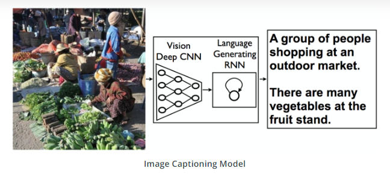
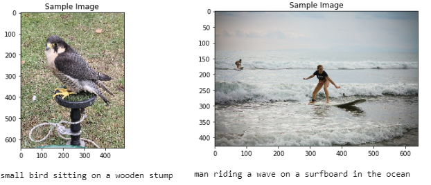

# Image_Captioning - Creating a Neural Network architecture to automatically generate captions from images using COCO dataset

The CNN-RNN architecture implemented in automatic image captioning model is referenced from this [paper](https://arxiv.org/pdf/1411.4555.pdf). This architecture takes image as input to CNN which after computation generates the feature vectors. These feature vectors are then passed through an Embedding layer to decoder LSTM cells which are responsible for generating corresponding texts. They name this model as Neural Image Caption (NIC) and have also established promising performance of NIC on various datasets. 

# Model Design
Dataset used : Microsoft Common Objects in Context (MS COCO) [dataset](http://cocodataset.org/#home)

# Model Output
Caption generated for test image by the designed model below

# To use
Clone the repository using command: git clone https://github.com/PreetiSajjan/Image_Captioning.git

The dataset used is included in the repository so need not to be downloaded explicitly.

# Contribution and References

Feel free to contribute to the project.

Please note that this project was done as part of my course "[A Nanodegree in Computer Vision](https://www.udacity.com/course/computer-vision-nanodegree--nd891)" 

** Kindly cite if any part of the code is referred. **
